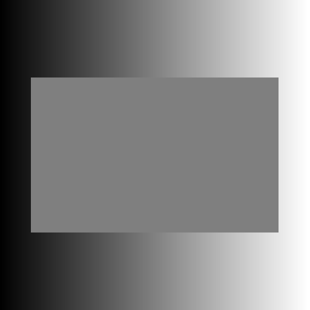
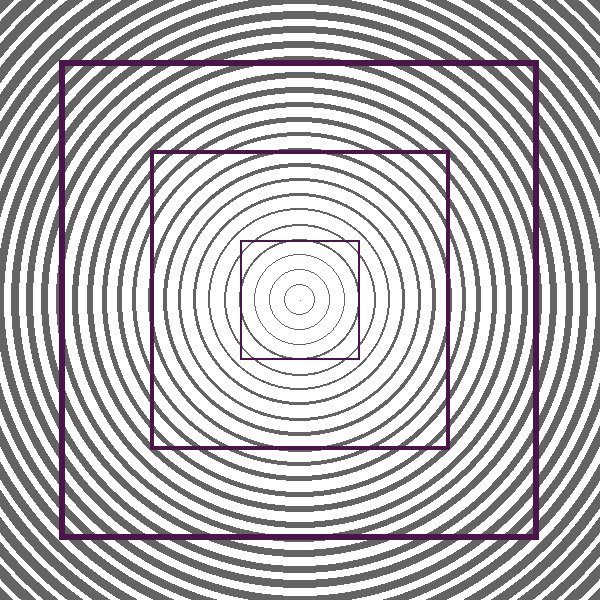
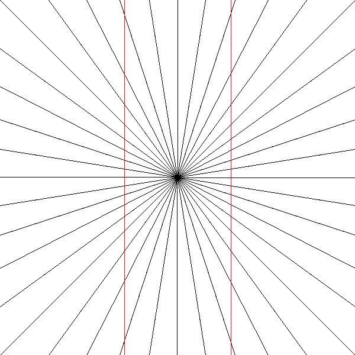
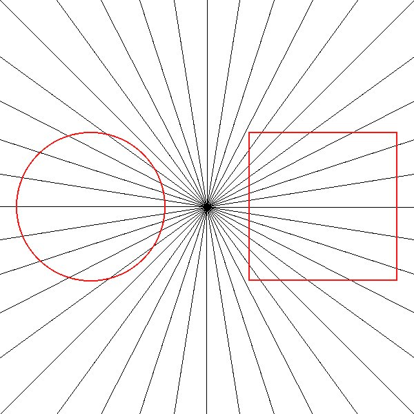
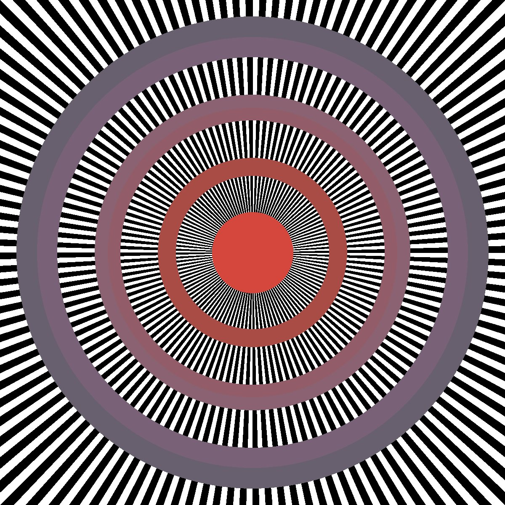
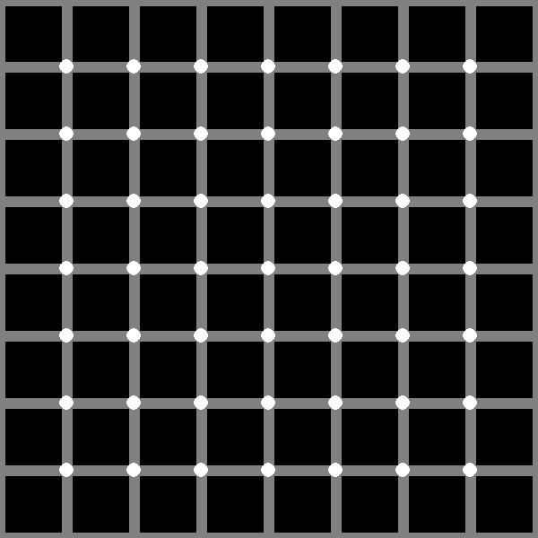
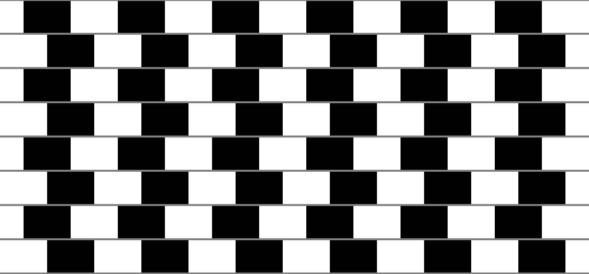

There are six optical illusions listed below. Choose one and try to reproduce the figure using Java. The [DrawingDemo](DrawingDemo.java) file shows how to use graphics in Java. You may change the dimensions of the figure by editing the `frame.setSize(400, 400);` line. Other than that, you should just have to edit the contents of the `paintComponent` method.

It may be helpful to consult the [documentation on the Graphics class](https://docs.oracle.com/javase/8/docs/api/java/awt/Graphics.html)

## 1. [Gradient illusion](GradientIllusion.java)

The background here is drawn with a gradient of gray colors ranging from a brightness of 0 to 255. But the rectangle in the middle is one rectangle of a mid-intensity gray, it does not have a color change in it!

## 2. [Curving squares](CurvingSquares.java)

The 3 purplish shapes really are squares, they are not curved.

The following three choices may require trigonometry. The radiating lines are drawn from the center outwards are spaced with a constant angle between them.

## 3. [Hering's illusion](HeringIllusion.java)

The red lines are not curved, they are actually straight parallel lines

## 4. [Eisenstein's illusion](EisensteinIllusion.java)

The red shapes are a true circle and a true square. Their distorted appearance is an illusion.

## 5. [Leviant Enigma](LeviantEnigma.java)

This is a recreation of a drawing called "Leviant Enigma". Most people see illusory motion or flow within the purple rings.

## 6. [Hermann Scintillating Grid](HermannScintillatingGrid.java)

The black dots appearing in each white circle are illusory.

## 7. [Cafe Wall](CafeWall.java)

The gray lines are actually straight and parallel.
